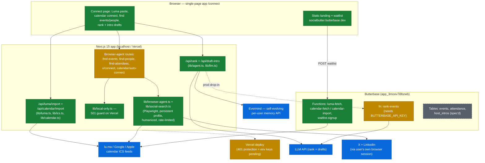
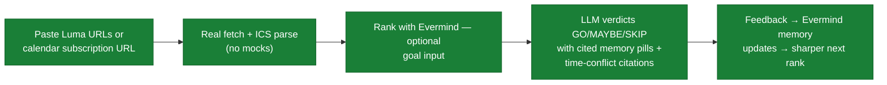
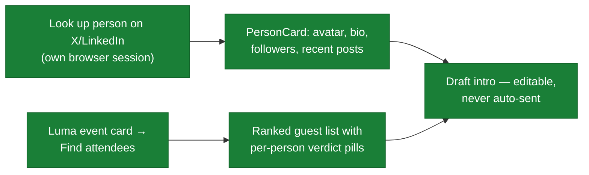
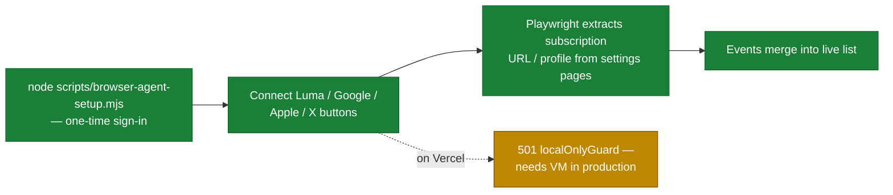

# SocialButter Project Map

**One page that answers: what is this system, what's built, what's planned, and how each feature flows.**

Generated from the codebase + GitHub state. Last synced: **2026-07-11** (main @ `1fd3dba`).
Hackathon project — Beta Fund × Evermind "One Person Company", SF, 2026-05-30. Post-hackathon Vercel deploy in flight.
Regeneration procedure: [bottom of this doc](#how-to-regenerate-this-map).

**Legend** — used in every diagram and table:

| Marker | Meaning |
|---|---|
| 🟢 / green node | Built and shipped |
| 🟡 / amber node | Partial — scaffolded or shipped with gaps |
| ⚪ / gray node | Planned — spec'd, not built |

---

## 1. System architecture

**Repo layout ↔ diagram:** `app/` = Browser + API routes · `lib/` = agent, LLM, calendar, browser-agent logic · Butterbase functions live in the Butterbase project (source inline via MCP `deploy_function`; docs in `docs/butterbase-functions.md`) · `scripts/` = smoke tests + browser-agent setup/run · `drafts/` = pre-scaffold artifacts.

---

## 2. Tech stack

| Layer | Stack |
|---|---|
| Frontend | Next.js 15.5 (App Router, single page `/connect`) · React 19.2 · TypeScript 5 · pnpm |
| Agent memory | Evermind HTTP API (`lib/evermind.ts`; writes are async — pre-seed before demos) |
| Ranking / drafts | LLM via `lib/llm.ts` (`LLM_API_KEY`); Butterbase AI gateway (`anthropic/claude-3.5-sonnet`) on the fn side |
| Backend / serverless | Butterbase Functions (`api.butterbase.ai/v1/app_3moov7i9bzwb/fn/*`) + Next.js API routes |
| Browser automation | Playwright (devDep, lazy-imported) · persistent Chrome profile `~/.socialbutter-browser-profile` · localhost-only (`localOnlyGuard`) |
| Deploy | Butterbase static hosting (canonical: socialbutter.butterbase.dev) · Vercel `ybuffet/socialbutter` (push-to-deploy) |
| Rule | **No mock user data anywhere** — fail loud / empty state / real fetch (CLAUDE.md §2) |

---

## 3. Feature list — built vs planned

No open GitHub issues; no PRs to date (hackathon-direct commits to main). Sources: README scope lock + STATUS.md log.

### Shipped 🟢

| Feature | Where |
|---|---|
| Luma event-URL paste + personal iCal subscription import | `lib/luma.ts`, `app/api/luma/import/route.ts` |
| Multi-source calendar import (Luma / iCloud / Google / generic ICS, dedupe, conflicts) | `lib/ics.ts`, `lib/calendar.ts`, `app/api/calendar/import/route.ts` |
| Evermind memory client (write feedback, retrieve ranking context) | `lib/evermind.ts`, `scripts/evermind-smoke.mjs` |
| LLM ranking with cited memory + hard time-conflict citations (GO/MAYBE/SKIP) | `lib/agent.ts`, `app/api/rank/route.ts` |
| Host / person intro drafting (draft-only, never sent) | `app/api/draft-intro/route.ts` |
| X + LinkedIn search & person lookup via user's own browser session | `lib/social-search.ts`, `app/api/find-{events,people}/route.ts` |
| Luma attendee scrape + rank | `app/api/find-attendees/route.ts` |
| One-click Connect Luma / Google / Apple / X (subscription-URL extraction) | `lib/browser-agent.ts`, `app/api/calendar/auto-connect/route.ts`, `app/api/x/connect/route.ts` |
| Backstage browser agent (RSVP, LinkedIn connect, rate-limited queue) | `lib/browser-agent.ts`, `scripts/browser-agent-*.{mjs,ts}` |
| Single-screen `/connect` UI (event cards, verdict pills, person cards, butterfly brand) | `app/connect/page.tsx`, `app/globals.css` |
| Landing page + live waitlist signup (Butterbase `fn:waitlist-signup`) | socialbutter.butterbase.dev (source staged outside repo) |
| Butterbase Functions: luma-fetch, calendar-fetch, calendar-import | `docs/butterbase-functions.md` |
| Multi-terminal sync protocol (STATUS.md heartbeat + hook) | `STATUS.md`, `docs/sync-protocol.md`, `.claude/sync-hook.sh` |

### Partial 🟡

| Feature | Gap | Where |
|---|---|---|
| Vercel deploy | Live but 401 (Deployment Protection on); `LLM_API_KEY` + `EVERMIND_API_KEY` not set | `next.config.ts`, `lib/local-only.ts` (unpushed local commit `79dd2f5`) |
| `fn:rank-events` on Butterbase | Deployed; 503 until `BUTTERBASE_API_KEY` set | `docs/butterbase-functions.md` |
| Browser-agent routes in production | Playwright can't run on Vercel/V8 isolates — localhost only; needs a VM (Fly/Render) | `lib/local-only.ts` |
| Butterbase persistence (events / attendance / host_intros tables) | Data model spec'd in README; app not wired to tables | `README.md` |

### Planned ⚪

| Feature | Tracking |
|---|---|
| Real outreach sending + follow-up auto-send | README "Cut for v1" — roadmap |
| Calendar API (OAuth) integration beyond ICS | README roadmap |
| LinkedIn / Instagram / X official API integration | README roadmap |
| Discovery-feed recommendation engine | README roadmap |
| `fn:luma-import`, `fn:rank`, `fn:draft-intro` full Path-A serverless port | STATUS.md 17:48 entry |
| Browser-agent worker box for production | STATUS.md 15:54 entry |

---

## 4. User flows

### Import & rank events

### Find people & draft intros

### One-click connect (browser agent, localhost only)

---

## How to regenerate this map

Token-cheapest procedure (all text, no image generation). From repo root, in one Claude Code turn:

1. **Built layer:** scan `app/api/*/route.ts`, `lib/*.ts`, `package.json`, `docs/butterbase-functions.md`.
2. **Planned layer:** `gh issue list --state open` + `gh pr list --state all --limit 20` + README "Cut for v1".
3. **Recent-built layer:** `git log --oneline` since the "Last synced" date + STATUS.md tail.
4. Update the three status tables, recolor Mermaid nodes (`:::built` / `:::partial` / `:::planned`), bump the sync date + main SHA.
5. Keep diagrams Mermaid-only (GitHub renders them natively; color via `classDef`).
